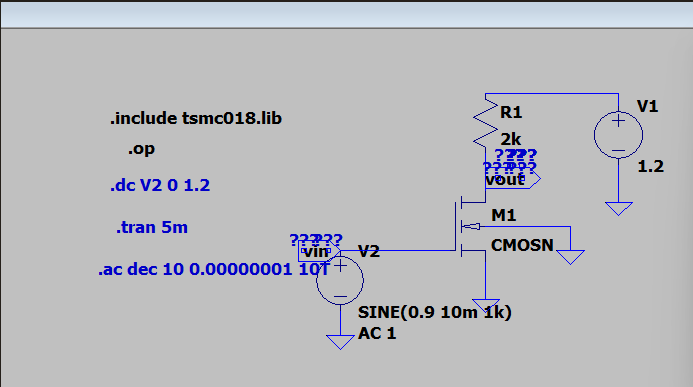
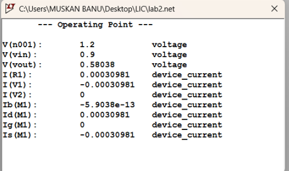
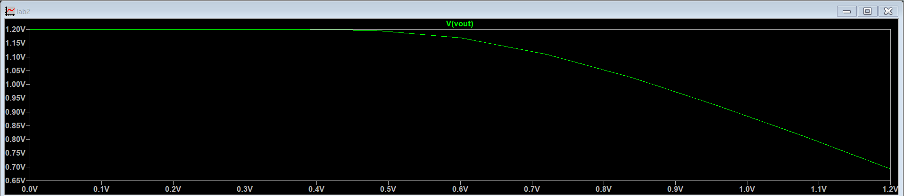
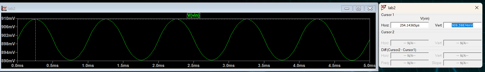

#  # Experiment-1-4NI24ec084-CS-Amplifier
Common sourse Amplifier using NMOS(TSMC180nm)LT-spice

## DC, AC and Transient Analysis of Common Source Amplifier
## Circuit Diagram

A common-source amplifier is a type of amplifier where the input signal is applied to the **gate**, and the output is taken from the **drain**. The source terminal is typically grounded.  

It provides:
- High voltage gain  
- 180° phase shift (signal inversion) between input and output  

This amplifier is widely used for amplifying weak analog signals. The voltage gain mainly depends on the **load resistor** and the **transconductance (gm)** of the MOSFET.

---

## Key Components and Their Roles

### 1. Rd (Drain Resistor)
- Provides the required voltage drop for amplification  
- Converts drain current variations into output voltage  
- Directly affects voltage gain  

---

### 2. W (Transistor Width)
- Determines the transconductance (gm) of the MOSFET  
- Larger width → Higher gm → Higher gain  
- Also affects bandwidth and current consumption  

---

### 3. Vdd (Drain Supply Voltage)
- Provides DC biasing for the NMOS transistor  
- Ensures the MOSFET operates in the saturation region  
- Affects output swing and operating point  

---

### 4. AC Input (SINE Source)
- Small signal applied at the gate  
- Used to analyze amplifier response  
- Helps perform AC and transient analysis  

---

## Analyses Performed

### 1. DC Analysis
- Determines operating point (bias point)  
- Ensures MOSFET operates in saturation region  

### 2. AC Analysis
- Determines voltage gain and frequency response  
- Helps evaluate bandwidth  

### 3. Transient Analysis
- Observes time-domain waveform behavior  
- Confirms phase inversion and amplification  

---

##  Aim:
To design and simulate a Common Source (CS) Amplifier using NMOS in TSMC 180nm technology using LTspice and evaluate:
- Operating point
- Voltage gain (transient + theoretical)
- AC response and bandwidth
- Gain Bandwidth Product (GBP)
- Unity Gain Bandwidth (UGB)

---

##  Design Specifications

| Parameter | Value |
|----------|------|
| Technology | TSMC 180nm |
| Supply Voltage (VDD) | 1.2 V |
| Power Constraint | ≤ 0.4 mW |
| Load Capacitance (CL) | 0.5 pF |
| Channel Length (L) | 360 nm |
| Biasing | Midpoint (Vout ≈ VDD/2) |

---

##  Theory
A Common Source amplifier provides high voltage gain with phase inversion.

### Drain Current (Saturation)
ID = (Kn / 2)(VGS − VT)²  
Kn = μn Cox (W/L)

---

## Design Calculations

### 1️⃣ Operating Point
Vout = VDD / 2 = 0.6 V  

Power constraint:
P = VDD × ID ≤ 0.4 mW  
ID ≤ 0.4m / 1.2 = 0.3 mA

---

---
##  MOSFET Width Calculation

To ensure the MOSFET operates in saturation while satisfying the power constraint, the device width (W) is calculated using the saturation current equation.

---

### Saturation Drain Current Equation
ID = (1/2) Kn (VGS − VT)²  

Where:  
Kn = μn Cox (W / L)

---

### Step 1 — Maximum Drain Current
Given power constraint:
P ≤ 0.4 mW  

ID ≤ P / VDD  
ID ≤ 0.4mW / 1.2V  
ID ≤ 0.3 mA

---

### Step 2 — Process Parameters (TSMC 180nm)
- Electron mobility (μn) = 273.8 × 10⁻⁴ m²/Vs  
- Oxide permittivity:
  εox = ε0 × εr  
  ε0 = 8.854 × 10⁻¹² F/m  
  εr = 3.9  
- Oxide thickness:
  tox = 4.1 × 10⁻⁹ m  

Cox = εox / tox

---

### Step 3 — Kn Expression
Kn = μn Cox (W / L)

Rearranging for W:
W = (2 ID L) / (μn Cox (Vov)²)

Where:
Vov = (VGS − VT) → Overdrive voltage

---

### Step 4 — Substituting Values
Using:
- ID ≈ 0.25–0.3 mA  
- L = 360 nm  
- Estimated Vov ≈ 0.2 V  

The calculated width:
W ≈ 3.3 µm

---

### Final Selected Value
For better bias stability and midpoint operation:

W = 4 µm

---

### * Reason for Choosing Larger Width
- Improves bias robustness  
- Ensures saturation across variations  
- Helps achieve Vout ≈ VDD/2

---

### *Drain Resistor
RD = (VDD − VDS) / ID  
RD = (1.2 − 0.6) / 0.3mA = 2kΩ
---

###  DC Operating Point

| W (µm) | ID | Vout |
|-------|----|------|
| 3.3 | 0.2 mA | 0.778 V |
| 4 | 0.25 mA | 0.695 V |
| 5 | 0.30 mA | 0.58 V |

Chosen: W = 4 µm

## DC Sweep Analysis

To analyze the DC transfer characteristics of the Common Source (CS) amplifier by sweeping the input voltage and observing the variation in output voltage.

### Theory

DC Sweep analysis is used to study how the output of a circuit varies with respect to a DC input source. In a Common Source amplifier, the input voltage (Vgs) is swept over a specified range while the corresponding output voltage (Vout) is measured.

For an NMOS operating in saturation region:

Id = (1/2) kn (Vov)^2

Where,
Vov = Vgs - Vth  
kn = μn Cox (W/L)

As the gate-to-source voltage (Vgs) increases:

• When Vgs < Vth → MOSFET is in Cut-off region → Id ≈ 0 → Vout ≈ VDD  
• When Vgs > Vth → MOSFET enters Saturation region → Id increases  
• Increase in Id causes larger voltage drop across drain resistor  
• Therefore, Vout decreases

This produces an inverse relationship between input and output, confirming that the Common Source amplifier provides voltage inversion.

### Observation

From the DC sweep graph:
- Output voltage remains high at low input voltage.
- As input voltage increases beyond threshold voltage, output voltage decreases.
- The curve shows the transfer characteristics of the amplifier.

### Inference

The DC sweep confirms:
- Proper biasing of the MOSFET
- Operation in saturation region
- Inverting behavior of the Common Source amplifier
- Suitable operating (Q) point for amplification
---

##  Transient Analysis

### Input
Vin(LP) = 890.36 mV  
Vin(HP) = 909.59 mV  
Vin(pp) = 19.2 mV  

### Output
Vout(LP) = 559.23 mV  
Vout(HP) = 601.64 mV  
Vout(pp) = 42.4 mV  

### Measured Gain
Av = Vout(pp) / Vin(pp) = 2.208  
Av(dB) = 20log(2.208) = 6.87 dB

---

##  Theoretical Gain
Av = gm RD  

gm = 2ID / Vov ≈ 2.1 mS  
Av ≈ 4.21 → 12.48 dB

### Reason for Difference
- Channel length modulation  
- Finite output resistance (ro)  
- Practical gain ≈ gm(RD || ro)

---

#  AC Analysis

The frequency response of the Common Source amplifier was analyzed for two loading conditions:
1. 1 fF capacitor (parasitic case)
2. 0.5 pF capacitor (practical load)

---

##  Case 1 — With 1 fF Capacitor (Parasitic Case)

Represents near-ideal unloaded output.

- Midband Gain ≈ 6 dB  
- 3 dB Bandwidth:
  fH ≈ 989.7 MHz  

### Linear Gain
Av = 10^(6/20) = 2  

### Gain Bandwidth Product
GBP = Av × fH  
GBP = 2 × 989.7 MHz  
GBP ≈ 1.97 GHz  

### Unity Gain Bandwidth
UGB ≈ 1.97 GHz  

 Very high bandwidth due to negligible capacitive loading.

---

##  Case 2 — With 0.5 pF Load Capacitor

Represents realistic output loading.

- Gain = 6.87 dB  
- 3 dB Gain = 3.87 dB  
- Bandwidth:
  fH = 171.41 MHz  

### Linear Gain
Av = 10^(6.87/20) = 2.206  

### Gain Bandwidth Product
GBP = 2.206 × 171.41 MHz  
GBP ≈ 378 MHz  

### Unity Gain Bandwidth
UGB ≈ 0.378 GHz  

 Bandwidth reduced due to increased capacitive loading.

---

##  Comparison

| Parameter | 1 fF | 0.5 pF |
|----------|------|--------|
| Gain (dB) | ~6 dB | 6.87 dB |
| Bandwidth | 989.7 MHz | 171.4 MHz |
| GBP | 1.97 GHz | 378 MHz |
| UGB | 1.97 GHz | 0.378 GHz |

---

##  Observation
Bandwidth is inversely proportional to load capacitance.  
Gain-Bandwidth Product remains approximately constant for a single-pole amplifier.

##  Conclusion
A Common Source Amplifier was successfully designed using TSMC 180nm NMOS under power constraints.

Key Results:
- Gain ≈ 6.8 dB  
- Bandwidth (with load) ≈ 171 MHz  
- GBP ≈ 378 MHz  
- UGB ≈ 0.378 GHz  

## Inference

The Common Source amplifier designed using TSMC 180nm NMOS successfully met the given constraints of low supply voltage (1.2V) and limited power (≤ 0.4 mW). Biasing the circuit at VDD/2 ensured maximum symmetrical output swing and stable operation in saturation.

The practical voltage gain (~6–7 dB) was lower than the theoretical gain due to non-ideal effects such as channel length modulation and finite output resistance (ro), highlighting the difference between ideal equations and real CMOS behavior.

AC analysis demonstrated the fundamental gain-bandwidth trade-off. With a very small parasitic capacitor (1 fF), the amplifier exhibited extremely high bandwidth (~GHz range). However, introducing a realistic load capacitance (0.5 pF) significantly reduced the bandwidth to ~171 MHz, proving that bandwidth is inversely proportional to load capacitance.

Despite bandwidth variation, the Gain-Bandwidth Product (GBP) remained approximately constant, validating single-pole amplifier theory. The Unity Gain Bandwidth (UGB) also closely matched GBP, further confirming expected analog design behavior.

Overall, the experiment demonstrates key analog CMOS design principles:
- Midpoint biasing maximizes signal swing
- Practical gain is limited by device non-idealities
- Capacitive loading dominates high-frequency performance
- Gain-bandwidth trade-off is unavoidable in amplifier design

This experiment provides a clear understanding of real-world analog design challenges and validates theoretical concepts through LTspice simulation.
---

##  Tools Used
- LTspice
- TSMC 180nm Model Library
